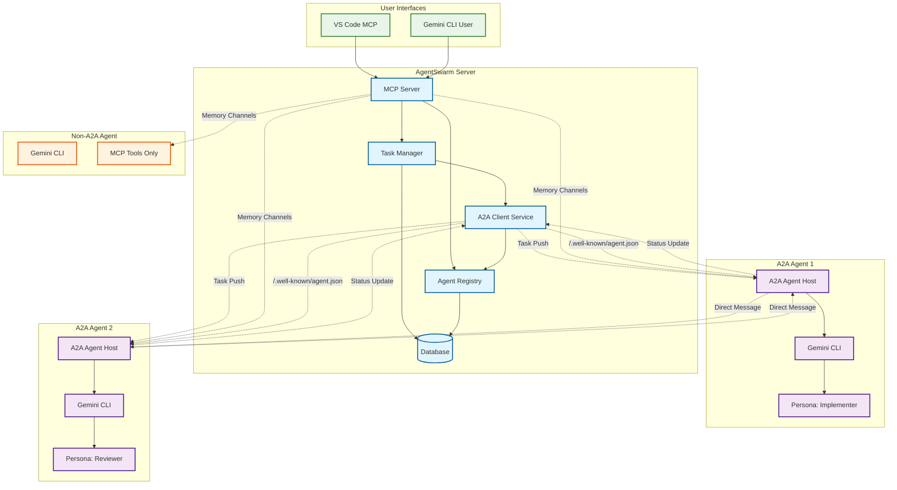
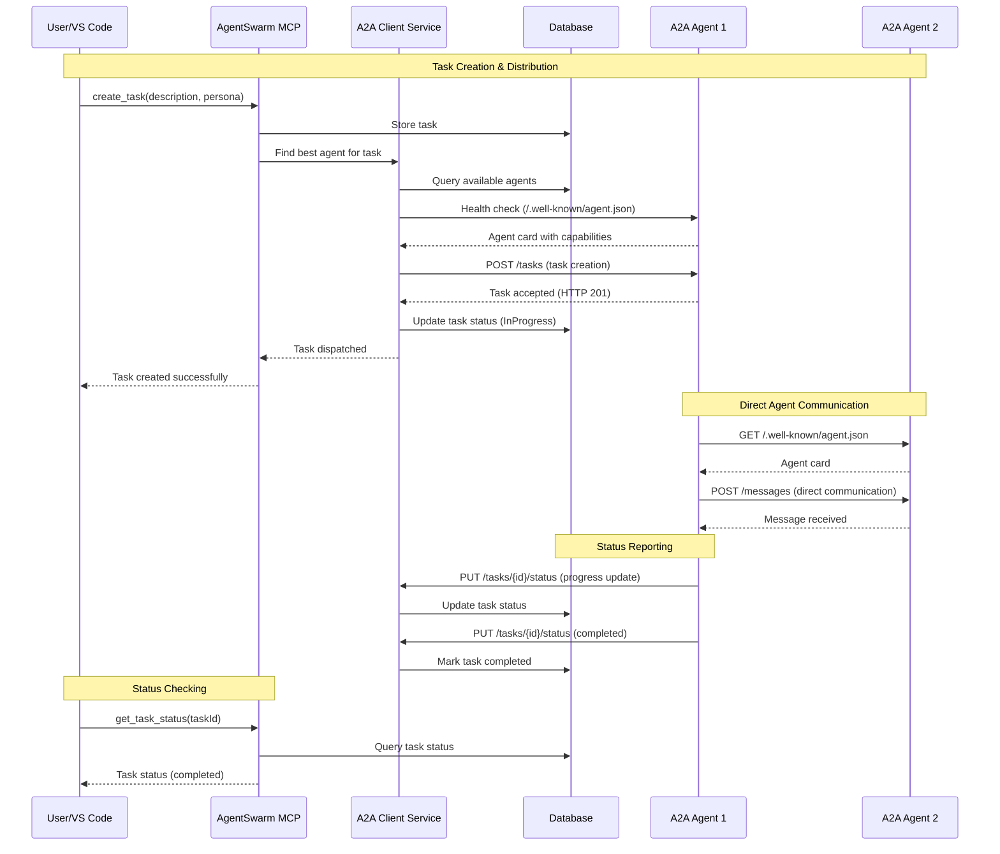

# A2A System Design

## Agent-to-Agent Communication for AgentSwarm

**Date:** September 5, 2025  
**Status:** System Design  
**Branch:** a2a-design-docs  

> **Note**: This document provides high-level system architecture and design patterns. For detailed technical implementation, see [A2A Implementation Guide](A2A_IMPLEMENTATION_GUIDE.md). For integration planning, see [A2A Integration Plan](A2A_INTEGRATION_PLAN.md).

---

## Architecture Overview

AgentSwarm integrates A2A protocol to enable direct agent-to-agent communication while maintaining existing MCP orchestration capabilities.

### Current System
- **AgentSwarm Server**: MCP orchestrator with memory channels for agent communication
- **Gemini CLI Agents**: JavaScript-based agents that poll for tasks via MCP tools
- **Communication**: Polling-based via MCP tools and memory channels

### Enhanced System with A2A
- **AgentSwarm Server**: MCP orchestrator + A2A client for direct agent communication
- **Gemini CLI Agents**: JavaScript agents enhanced with optional A2A server capabilities
- **Communication**: Direct agent-to-agent push notifications + MCP fallback

## Core Components

### 1. A2A Client Service (AgentSwarm Server)

The A2A Client Service enables AgentSwarm to communicate directly with A2A-capable agents. Key responsibilities:

- **Agent Discovery**: Locate and verify A2A agents via well-known URIs
- **Direct Communication**: Send messages and tasks directly to agents
- **Task Management**: Create, monitor, and cancel tasks on remote agents
- **Health Monitoring**: Track agent availability and capabilities
- **Best Agent Selection**: Find optimal agents for specific tasks based on persona and workload

### 2. A2A Agent Host (Gemini CLI)

The A2A Agent Host transforms standard Gemini CLI agents into A2A-capable agents. Core functions:

- **A2A Server**: Hosts A2A endpoints for receiving tasks and messages
- **Task Processing**: Integrates A2A tasks with Gemini processing pipeline
- **Status Reporting**: Provides real-time status updates via A2A callbacks
- **Agent Card**: Exposes agent capabilities and metadata for discovery
- **Configuration Integration**: Uses AgentSwarm-provided configuration files

### 3. Enhanced MCP Tools

- **create_task**: Support task dependencies and A2A dispatch
- **list_agents**: A2A agent discovery with metadata
- **agent_message**: Direct A2A agent communication
- **get_task_status**: A2A status checking with MCP fallback

### 4. Agent Configuration System

AgentSwarm creates isolated environments for each agent with comprehensive configuration:

- **Git Worktrees**: Isolated file system environments for each agent instance
- **Persona Integration**: Agent-specific persona files and system prompts
- **A2A Settings**: Port assignments and A2A capabilities configuration
- **AgentSwarm Integration**: Connection details and agent identification
- **Gemini Configuration**: Model selection, temperature, and processing parameters

## Database Schema Extensions

### Agent Metadata

Extends existing Agents table with A2A-specific information:
- A2A endpoint URLs for direct communication
- Agent capabilities and skills (JSON metadata)
- Health check timestamps for monitoring

### Task Dependencies

New table supporting workflow orchestration:
- Parent-child task relationships
- Dependency types (blocking, parallel, optional)
- Creation timestamps for tracking

### Communication Logging

Optional monitoring table for A2A interactions:
- Agent communication events
- Message types and content
- Workflow correlation identifiers

## Communication Patterns

### Agent Discovery

1. AgentSwarm maintains registry of known agents
2. A2A agents expose agent cards at `/.well-known/agent.json`
3. Health checking via periodic discovery calls

### Task Distribution

1. Tasks created via MCP tools
2. AgentSwarm identifies best available A2A agent
3. Direct task push via A2A protocol
4. Fallback to MCP memory channels for non-A2A agents

### Status Reporting

1. A2A agents report status via push notifications
2. AgentSwarm updates task status in database
3. MCP tools query status from database

## Agent Lifecycle

### Startup
1. AgentSwarm creates git worktree for agent
2. Copies persona files to worktree
3. Generates agent configuration file
4. Launches Gemini CLI with configuration
5. Agent starts A2A server (if enabled)

### Operation
1. Agent receives tasks via A2A push notifications
2. Processes tasks using persona-specific prompts
3. Reports status and results via A2A callbacks
4. Can communicate directly with other A2A agents

### Shutdown
1. Agent stops A2A server
2. Reports final status to AgentSwarm
3. AgentSwarm cleans up worktree

## Mixed Environment Support

The system supports both A2A-enabled and traditional MCP-only agents:

- **A2A to A2A**: Direct communication via A2A protocol
- **A2A to MCP**: Via AgentSwarm server mediation
- **MCP to A2A**: Via MCP tools with A2A dispatch
- **MCP to MCP**: Via memory channels (existing system)

## Implementation Phases

### Phase 1: A2A Client Integration
- Add A2A client service to AgentSwarm server
- Implement agent discovery and communication
- Extend database schema

### Phase 2: Gemini CLI A2A Package
- Create @aiswarm/a2a-agent NPM package
- Implement A2A server capabilities for Gemini CLI
- Agent configuration file system

### Phase 3: Task Dispatch Service
- Implement push-based task delivery
- Agent registry with health monitoring
- Mixed environment support

### Phase 4: Integration Testing
- End-to-end testing with multiple agents
- Performance validation
- Documentation updates