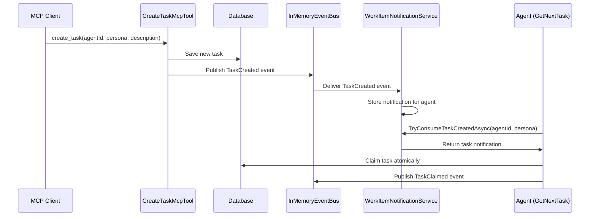
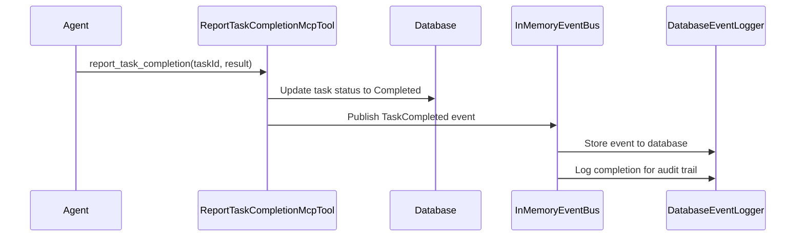

# Event-Driven Architecture Documentation

## Overview

The AISwarm coordination system implements a sophisticated event-driven architecture using an in-memory event bus that enables real-time communication between agents, tasks, and coordination services. This architecture provides decoupled, scalable, and responsive multi-agent coordination.

## Core Architecture

### Event Bus Foundation

The system is built around `InMemoryEventBus<TType, TPayload>`, a generic event bus implementation that supports:

- **Type-Safe Events**: Generic type parameters ensure compile-time safety
- **Channel-Based Communication**: Uses .NET's `System.Threading.Channels` for efficient async communication
- **Bounded/Unbounded Channels**: Configurable channel capacity for memory management
- **Subscription Filtering**: Event filters allow precise subscription targeting
- **Automatic Cleanup**: Proper disposal and resource cleanup

### Event Categories

The system implements two primary event categories:

#### 1. Task Events (`TaskEventEnvelope`)

Events related to task lifecycle management:

- **TaskCreated**: New task has been created and assigned
- **TaskClaimed**: Agent has claimed a task for processing
- **TaskCompleted**: Task has been successfully completed
- **TaskFailed**: Task has failed with error details

#### 2. Agent Events (`AgentEventEnvelope`)

Events related to agent lifecycle management:

- **AgentStarted**: New agent has been launched
- **AgentStopped**: Agent has been terminated or stopped
- **AgentHeartbeat**: Agent status update (implied through task polling)

## Event Components

### Event Envelopes

Event envelopes wrap payloads with metadata for routing and filtering:

```csharp
public class EventEnvelope<TType, TPayload>
    where TType : struct, Enum
    where TPayload : class, IEventPayload
{
    public TType EventType { get; init; }
    public TPayload Payload { get; init; } = null!;
    public DateTime Timestamp { get; init; }
    public string EventId { get; init; } = Guid.NewGuid().ToString();
}
```

### Event Payloads

All event payloads implement `IEventPayload` and contain relevant data:

#### Task Event Payloads

```csharp
// Task Created Event
public class TaskCreatedPayload : IEventPayload
{
    public string TaskId { get; init; } = null!;
    public string? AgentId { get; init; }
    public string PersonaId { get; init; } = null!;
    public string Description { get; init; } = null!;
    public TaskPriority Priority { get; init; }
}

// Task Claimed Event
public class TaskClaimedPayload : IEventPayload
{
    public string TaskId { get; init; } = null!;
    public string AgentId { get; init; } = null!;
    public DateTime ClaimedAt { get; init; }
}

// Task Completed Event
public class TaskCompletedPayload : IEventPayload
{
    public string TaskId { get; init; } = null!;
    public string AgentId { get; init; } = null!;
    public string Result { get; init; } = null!;
    public DateTime CompletedAt { get; init; }
}

// Task Failed Event
public class TaskFailedPayload : IEventPayload
{
    public string TaskId { get; init; } = null!;
    public string AgentId { get; init; } = null!;
    public string ErrorMessage { get; init; } = null!;
    public DateTime FailedAt { get; init; }
}
```

#### Agent Event Payloads

```csharp
public class AgentLifecyclePayload : IAgentLifecyclePayload
{
    public string AgentId { get; init; } = null!;
    public string PersonaId { get; init; } = null!;
    public DateTime Timestamp { get; init; }
    public string? AdditionalData { get; init; }
}
```

### Event Filtering

The system supports sophisticated event filtering through `EventFilter<TType, TPayload>`:

```csharp
public class EventFilter<TType, TPayload>
    where TType : struct, Enum
    where TPayload : class, IEventPayload
{
    public HashSet<TType>? EventTypes { get; init; }
    public Func<TPayload, bool>? PayloadFilter { get; init; }
    public TimeSpan? MaxAge { get; init; }
    
    public bool Matches(EventEnvelope<TType, TPayload> envelope)
    {
        // Filter implementation
    }
}
```

## Notification Services

### WorkItemNotificationService

Manages task-related events and provides coordination between task creation and agent polling:

**Key Features:**

- **Event Subscription**: Subscribes to TaskCreated events for real-time task notifications
- **Agent Notification**: Notifies specific agents when tasks matching their persona are created
- **Task Consumption**: Provides `TryConsumeTaskCreatedAsync` for agents to check for waiting tasks
- **Filtering**: Filters events by agent ID and persona type

**Usage in Task Coordination:**

```csharp
public class WorkItemNotificationService : BaseNotificationService<TaskEventType, IEventPayload>
{
    // Subscribes to TaskCreated events
    public async Task SubscribeForTaskCompletion(params string[] taskIds)
    
    // Attempts to consume a pending task notification
    public async Task<string?> TryConsumeTaskCreatedAsync(
        string agentId, 
        string personaId, 
        CancellationToken cancellationToken)
}
```

### AgentNotificationService

Manages agent lifecycle events:

**Key Features:**

- **Agent Registration**: Tracks agent start/stop events
- **Status Monitoring**: Provides agent status tracking
- **Lifecycle Management**: Coordinates agent lifecycle with task system

### DatabaseEventLoggerService

Provides persistent event logging for audit trails and debugging:

**Key Features:**

- **Event Persistence**: Stores all events in SQLite database
- **Audit Trail**: Maintains complete history of system events
- **Query Support**: Enables event history queries and analysis
- **Performance**: Asynchronous logging with transaction support

## Event Flow Examples

### Task Creation and Assignment Flow



### Task Completion Flow



## Configuration and Setup

### Event Bus Configuration

The event bus can be configured with bounded channels for memory management:

```csharp
// Unbounded channel (default)
var eventBus = new InMemoryEventBus<TaskEventType, IEventPayload>();

// Bounded channel with capacity limit
var options = new BoundedChannelOptions(capacity: 1000)
{
    FullMode = BoundedChannelFullMode.Wait,
    SingleReader = false,
    SingleWriter = false
};
var boundedEventBus = new InMemoryEventBus<TaskEventType, IEventPayload>(options);
```

### Service Registration

Event services are registered in the dependency injection container:

```csharp
public static class ServiceRegistration
{
    public static IServiceCollection AddEventingServices(this IServiceCollection services)
    {
        services.AddSingleton<IEventBus<TaskEventType, IEventPayload>, 
                              InMemoryEventBus<TaskEventType, IEventPayload>>();
        services.AddSingleton<IEventBus<AgentEventType, IAgentLifecyclePayload>, 
                              InMemoryEventBus<AgentEventType, IAgentLifecyclePayload>>();
        
        services.AddSingleton<IWorkItemNotificationService, WorkItemNotificationService>();
        services.AddSingleton<IAgentNotificationService, AgentNotificationService>();
        services.AddSingleton<DatabaseEventLoggerService>();
        
        return services;
    }
}
```

## Performance Characteristics

### Memory Management

- **Channel Capacity**: Bounded channels prevent memory leaks during high event volumes
- **Event Cleanup**: Automatic disposal cleans up subscriptions and channels
- **Garbage Collection**: Events are eligible for GC after delivery

### Throughput

- **Async Processing**: Full async/await support for non-blocking event processing
- **Concurrent Delivery**: Multiple subscribers can process events concurrently
- **Batch Processing**: Events can be processed in batches for efficiency

### Scalability

- **Subscription Filtering**: Reduces event processing overhead through targeted delivery
- **Channel Isolation**: Each subscription gets its own channel for isolation
- **Type Safety**: Generic constraints prevent runtime type errors

## Integration with MCP Tools

### Task Management Tools Integration

**CreateTaskMcpTool:**

```csharp
// Publishes TaskCreated event after successful task creation
await workItemNotifications.NotifyTaskCreatedAsync(newTask);
```

**GetNextTaskMcpTool:**

```csharp
// Consumes TaskCreated notifications
var preferredTaskId = await workItemNotifications.TryConsumeTaskCreatedAsync(
    agentId, agentInfo.PersonaId, CancellationToken.None);

// Publishes TaskClaimed event after successful task claiming
await workItemNotifications.NotifyTaskClaimedAsync(task, agentId);
```

**ReportTaskCompletionMcpTool:**

```csharp
// Publishes TaskCompleted event
await workItemNotifications.NotifyTaskCompletedAsync(task, result);
```

**ReportTaskFailureMcpTool:**

```csharp
// Publishes TaskFailed event
await workItemNotifications.NotifyTaskFailedAsync(task, errorMessage);
```

## Error Handling and Resilience

### Event Delivery Guarantees

- **At-Least-Once Delivery**: Events are delivered to all active subscribers
- **Channel Overflow**: Bounded channels can be configured to wait or drop events
- **Subscriber Failures**: Failed subscribers don't affect other subscribers

### Error Recovery

- **Database Persistence**: Events are persisted for recovery scenarios
- **Event Replay**: System can replay events from database if needed
- **Graceful Degradation**: System continues functioning even if some subscribers fail

### Monitoring and Debugging

- **Event Logging**: All events are logged to database for audit trails
- **Subscription Tracking**: Active subscriptions are tracked for monitoring
- **Performance Metrics**: Event delivery timing and throughput can be measured

## Best Practices

### Event Design

1. **Immutable Payloads**: Event payloads should be immutable to prevent side effects
2. **Rich Context**: Include sufficient context in events for subscribers to act
3. **Consistent Naming**: Use consistent event naming conventions
4. **Versioning**: Design events with versioning in mind for future evolution

### Subscription Management

1. **Targeted Filtering**: Use specific filters to reduce unnecessary event processing
2. **Resource Cleanup**: Properly dispose of subscriptions to prevent memory leaks
3. **Error Handling**: Implement robust error handling in event handlers
4. **Async Processing**: Use async/await for non-blocking event processing

### Performance Optimization

1. **Bounded Channels**: Use bounded channels in high-throughput scenarios
2. **Batch Processing**: Process events in batches when possible
3. **Selective Subscription**: Only subscribe to events you actually need
4. **Connection Pooling**: Reuse database connections for event logging

## Testing Strategies

### Unit Testing

```csharp
[Test]
public async Task ShouldDeliverTaskCreatedEventToSubscribers()
{
    var eventBus = new InMemoryEventBus<TaskEventType, IEventPayload>();
    var filter = new EventFilter<TaskEventType, IEventPayload>
    {
        EventTypes = new HashSet<TaskEventType> { TaskEventType.TaskCreated }
    };
    
    var events = new List<EventEnvelope<TaskEventType, IEventPayload>>();
    var subscription = eventBus.Subscribe(filter);
    
    // Collect events asynchronously
    _ = Task.Run(async () =>
    {
        await foreach (var eventEnvelope in subscription)
        {
            events.Add(eventEnvelope);
        }
    });
    
    // Publish test event
    await eventBus.PublishAsync(TaskEventType.TaskCreated, new TaskCreatedPayload
    {
        TaskId = "test-task",
        PersonaId = "implementer"
    });
    
    // Verify event delivery
    await Task.Delay(100); // Allow for async delivery
    events.Should().HaveCount(1);
    events[0].EventType.Should().Be(TaskEventType.TaskCreated);
}
```

### Integration Testing

Integration tests verify end-to-end event flow through MCP tools:

```csharp
[Test]
public async Task ShouldCoordinateTaskCreationAndRetrieval()
{
    // Create task through MCP tool
    var createResult = await createTaskTool.CreateTaskAsync(
        agentId: "test-agent",
        persona: "implementer", 
        description: "Test task");
    
    // Agent should receive notification
    var getResult = await getNextTaskTool.GetNextTaskAsync("test-agent");
    
    getResult.Success.Should().BeTrue();
    getResult.Task.Should().NotBeNull();
}
```

This event-driven architecture provides the foundation for sophisticated multi-agent coordination, enabling real-time communication, decoupled components, and scalable agent management in the AISwarm system.