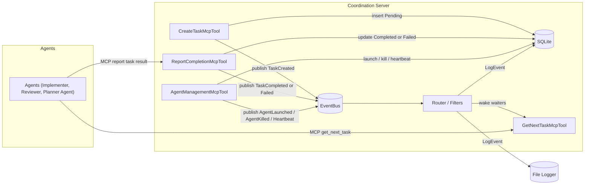

# Event-Driven Notifications for Agent Coordination

Author: AI Swarm Team  
Date: 2025-08-24

## Overview

Replace periodic DB polling with an in-memory, event-driven notification subsystem to wake waiting operations (e.g., `get_next_task`) immediately when relevant state changes occur. Keep SQLite as the source of truth; events are non-durable hints and telemetry.

Goals:

- Lower latency and database load by eliminating fixed-interval polling
- Support multiple event types (task lifecycle, agent lifecycle, logs)
- Allow multiple independent subscribers (agents, planners, log sinks)
- Preserve correctness via DB-verified state transitions

## High-Level Architecture



## Event Model

- Envelope: `EventEnvelope { Id, Type, Timestamp, CorrelationId, Actor, Payload, Tags[], Severity? }`
- Types: `TaskCreated`, `TaskUpdated`, `TaskCompleted`, `TaskFailed`, `AgentLaunched`, `AgentHeartbeat`, `AgentKilled`, `LogEvent`, `Custom`
- Payloads: Minimal identifiers (e.g., `taskId`, `agentId`, `persona`)—consumers re-query DB

## Interfaces

```csharp
public record EventEnvelope(
    string Type,
    DateTimeOffset Timestamp,
    string? CorrelationId,
    string? Actor,
    object? Payload,
    IReadOnlyList<string>? Tags = null,
    LogLevel? Severity = null);

public record EventFilter(
    IReadOnlyList<string>? Types = null,
    Guid? AgentId = null,
    string? Persona = null,
    Guid? TaskId = null,
    LogLevel? MinSeverity = null,
    Func<EventEnvelope, bool>? Predicate = null);

public interface IEventBus
{
    IAsyncEnumerable<EventEnvelope> Subscribe(EventFilter filter, CancellationToken ct = default);
    ValueTask PublishAsync(EventEnvelope evt, CancellationToken ct = default);
    bool TryPublish(EventEnvelope evt); // non-blocking best-effort
}

public interface IEventSink
{
    Task OnEventAsync(EventEnvelope evt, CancellationToken ct);
}

public interface IWorkItemNotificationService
{
    IAsyncEnumerable<EventEnvelope> SubscribeForAgent(Guid agentId, CancellationToken ct = default);
    IAsyncEnumerable<EventEnvelope> SubscribeForPersona(string persona, CancellationToken ct = default);
    ValueTask PublishTaskCreated(Guid taskId, Guid? agentId, string? persona);
    ValueTask PublishTaskCompleted(Guid taskId);
    ValueTask PublishTaskFailed(Guid taskId, string reason);
}
```

## Routing & Backpressure

- Backing: `System.Threading.Channels` per subscriber, bounded capacity (e.g., 64)
- Router performs filter matching and fan-out
- Overflow strategy: drop-oldest or coalesce frequent types (e.g., coalesce persona `TaskCreated` → "NewTasksAvailable"; drop-oldest for `AgentHeartbeat`)
- Configuration: select strategy and capacity per-subscriber and/or per-event-type
- Metrics: counters for dropped events per subscriber/type

Example configuration (illustrative):

```json
{
  "EventBus": {
    "Subscribers": {
      "GetNextTaskRouter": { "Capacity": 64, "Overflow": "Coalesce", "CoalesceTypes": ["TaskCreated"], "LatencyBudgetMs": 50 },
      "LoggingSink": { "Capacity": 2048, "Overflow": "Block" }
    }
  }
}
```

## Tool/Service Integration

- `CreateTaskMcpTool`: insert Pending → `PublishTaskCreated`
- `GetNextTaskMcpTool`: fast-path DB check; if none, `SubscribeForAgent/Persona` and await; on wake, re-query and atomic claim
- `ReportTaskCompletionMcpTool`: update status → `PublishTaskCompleted/Failed`
- `AgentManagementMcpTool`: launch/kill/heartbeat → publish corresponding events
- Optional: `IAppLogger` adapter emits `LogEvent` to bus for sinks

Note: The DB logger sink writes into the existing SQLite database used by the coordination server; no external database is introduced.

## Concurrency & Correctness

- DB remains the authority; events only wake consumers
- Atomic state transitions enforced via conditional updates (e.g., `Pending -> InProgress` with `WHERE Status=Pending`)
- Multiple agents can be woken by persona events; only one wins DB claim; others continue waiting
- Thundering herd mitigation: optionally apply small random jitter before re-query when many agents share a persona

## Resilience

- Server restart clears channels; agents re-subscribe on next call
- Timeouts respected using existing `GetNextTaskConfiguration` for long-poll boundaries
- Cancellation tokens cleanly remove subscriptions
- Graceful shutdown: attempt to drain channels, allow sinks to flush in-flight items; bound by shutdown timeout
- Publish watchdog: warn or error if `PublishAsync` exceeds latency budget (possible routing backpressure or deadlock)
- Poison-pill resilience: wrap subscriber processing in try/catch; drop bad events with error log, continue stream

## Testing Strategy

- Unit: filter matching, backpressure, coalescing, sink invocation
- Integration: sleeping agent woken by `TaskCreated` and successfully claims; two agents one task → single winner; kill agent interrupts waiters and marks dangling tasks failed
- Perf: notify-to-claim latency vs polling baseline; memory under bursty publication
- Watchdog tests: induce artificial delays to assert warnings/errors when publish latency budget exceeded
- Poison event tests: ensure bad payloads don’t crash subscribers and are logged

## Migration / Roll-in

- Small project: no feature flags; event bus enabled by default
- Keep polling code paths as safety net in `GetNextTaskMcpTool` (fast-path first, then await)

## Open Questions

- Do we want a dedicated `EventLog` table for durable audit? (separate from transient bus)
- Should we expose a public MCP tool for subscribing to certain event classes (e.g., planner waiting on completion), or keep it server-internal and let planners poll `get_task_status`?
- Coalescing thresholds per event type? Configurable capacities?

## Metrics & Observability

- Metrics:
  - `events_published_total{type,actor}`
  - `events_delivered_total{type,subscriber}`
  - `event_delivery_latency_seconds{type,subscriber}` (histogram)
  - `subscriber_channel_capacity_percent{subscriber}` (gauge)
- Logs:
  - Log dropped events with event details (Warning/Error)
  - Log publish watchdog breaches with routing context
- Durable Audit (optional, recommended for key lifecycle):
  - `EventLog` table for `TaskCreated`, `TaskCompleted`, `TaskFailed` with minimal payload (IDs, timestamps, actor)

### Diagram Layout Notes

Mermaid auto-layout can push `GetNextTaskMcpTool` to a corner when there are many bidirectional cross-cluster edges. To stabilize positioning:

- Keep all server internals inside a single subgraph with a local top-to-bottom flow.
- Route wake-ups from `Router` to `GetNextTaskMcpTool` instead of drawing many external edges to it.
- Represent agent interactions as one-way edges to the server tools to reduce layout tension.
