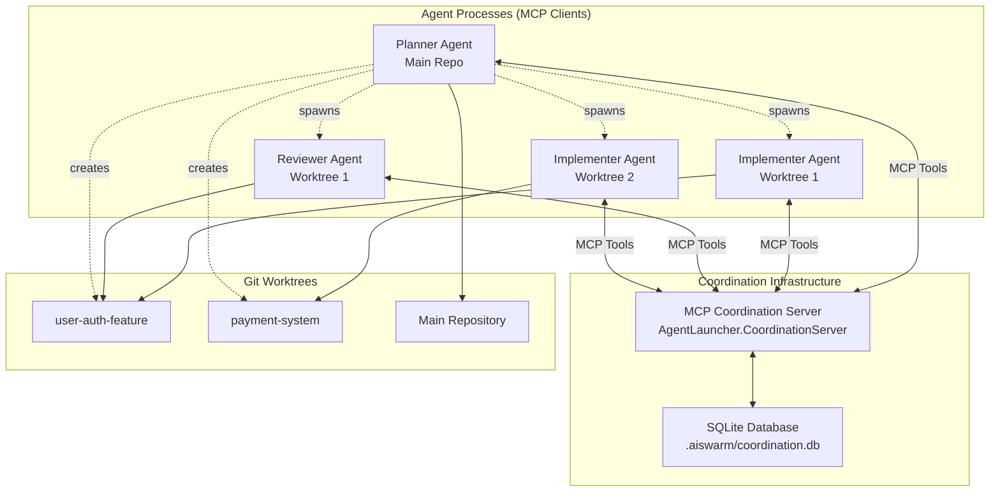
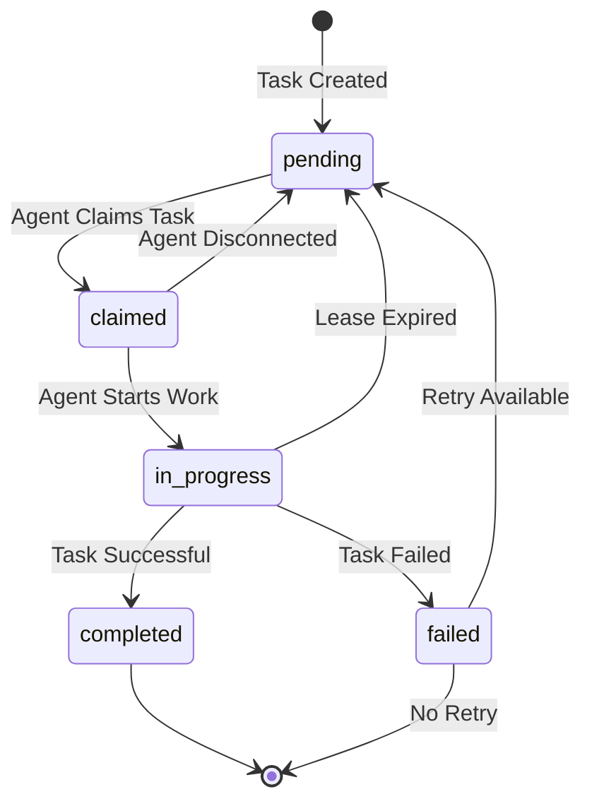
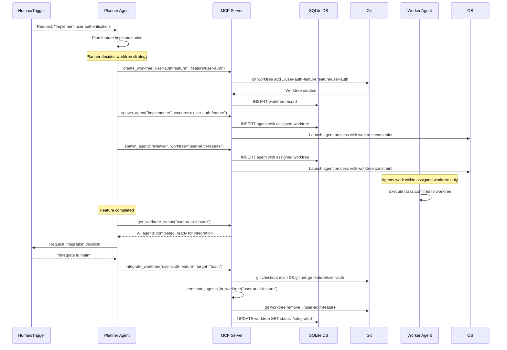
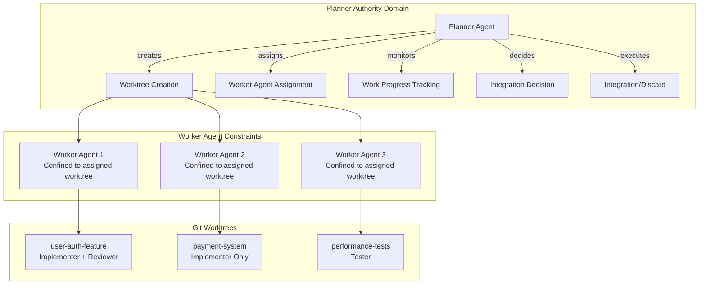
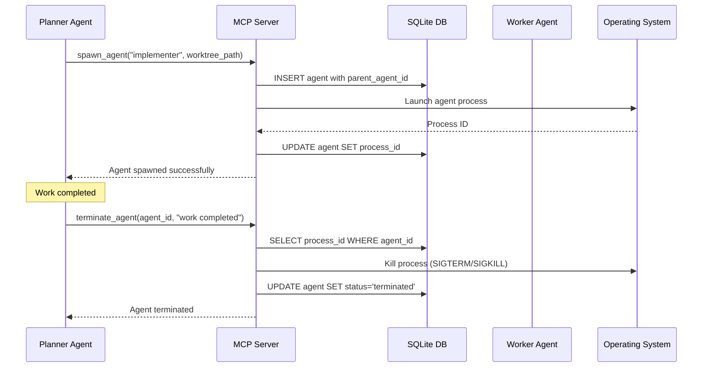
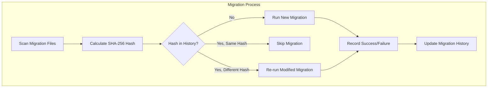

# SQLite Task Coordination System Design

## Architecture Overview

A sophisticated task coordination system using SQLite as the central database and **standalone MCP server** for agent communication, enabling complex workflow decomposition and persona-based task assignment. The system follows clean architecture principles with separate projects for agent launching and coordination concerns.

### Multi-Project Solution Structure

```text
src/
├── AgentLauncher/                    # Existing agent launcher (MCP client)
│   ├── Program.cs                    # CLI interface for launching agents
│   ├── Services/                     # Agent-specific services (ContextManager, etc.)
│   └── Resources/                    # Persona definitions
├── AgentLauncher.CoordinationServer/ # New MCP server project
│   ├── Program.cs                    # MCP server host with stdio transport
│   ├── Services/                     # Task coordination, worktree management
│   ├── Tools/                        # MCP tool implementations
│   └── Data/                         # SQLite database access layer
└── AgentLauncher.Shared/             # Shared contracts and models
    ├── Models/                       # Task, Agent, Worktree models
    └── Contracts/                    # ITaskCoordinationService interfaces
```

## High-Level Architecture



**Key Architecture Benefits:**

- **Clean Separation**: Agent launcher and coordination server are separate concerns
- **MCP Compliance**: Follows standard Model Context Protocol patterns
- **Testability**: Each project can be unit tested independently
- **Scalability**: Coordination server runs independently from agent processes
- **Maintainability**: Clear project boundaries and responsibilities

## Task Lifecycle Flow



## Planner-Controlled Worktree Management



## Database Schema Design

### Migration Tracking

```sql
-- Migration history tracking with hash verification
CREATE TABLE migration_history (
    id INTEGER PRIMARY KEY AUTOINCREMENT,
    migration_name TEXT NOT NULL UNIQUE,
    script_hash TEXT NOT NULL,
    applied_at DATETIME NOT NULL DEFAULT CURRENT_TIMESTAMP,
    execution_time_ms INTEGER NOT NULL,
    success BOOLEAN NOT NULL DEFAULT 1,
    reason TEXT                     -- "New migration", "Script modified", etc.
);

CREATE INDEX idx_migration_name ON migration_history(migration_name);
CREATE INDEX idx_migration_applied_at ON migration_history(applied_at);
```

### Core Tables

```sql
-- Persona definitions (migrate from file-based)
CREATE TABLE personas (
    id TEXT PRIMARY KEY,           -- 'planner', 'implementer', etc.
    name TEXT NOT NULL,            -- Human readable name
    definition TEXT NOT NULL,      -- Markdown/JSON persona content
    created_at TEXT NOT NULL DEFAULT (datetime('now')),
    updated_at TEXT NOT NULL DEFAULT (datetime('now'))
);

-- Immutable task definitions
CREATE TABLE tasks (
    id INTEGER PRIMARY KEY AUTOINCREMENT,
    title TEXT NOT NULL,           -- "Design login API"
    description TEXT NOT NULL,     -- Detailed task description
    persona_id TEXT NOT NULL,      -- Required persona for this task
    context_ref TEXT,              -- Reference to context files/data
    priority INTEGER DEFAULT 0,    -- Higher = more important
    created_by TEXT,               -- Agent ID that created task
    created_at TEXT NOT NULL DEFAULT (datetime('now')),
    metadata TEXT,                 -- JSON for extensibility
    FOREIGN KEY (persona_id) REFERENCES personas(id)
);

-- Mutable task execution state
CREATE TABLE task_status (
    task_id INTEGER PRIMARY KEY,
    status TEXT NOT NULL CHECK (status IN ('pending', 'claimed', 'in_progress', 'completed', 'failed', 'cancelled')),
    assigned_agent_id TEXT,        -- Which agent claimed this
    claimed_at TEXT,               -- When task was claimed
    started_at TEXT,               -- When work actually began
    completed_at TEXT,             -- When task finished
    lease_expires_at TEXT,         -- Lease timeout for failure detection
    result_data TEXT,              -- JSON result from completion
    error_message TEXT,            -- Error details if failed
    retry_count INTEGER DEFAULT 0, -- Number of retry attempts
    FOREIGN KEY (task_id) REFERENCES tasks(id)
);

-- Enhanced database schema for planner-controlled worktrees
CREATE TABLE worktrees (
    name TEXT PRIMARY KEY,             -- Planner-assigned name (e.g., "user-auth-feature")
    branch_name TEXT NOT NULL,         -- Git branch name (e.g., "feature/user-auth")
    created_by TEXT NOT NULL,          -- Planner agent that created it
    created_at TEXT NOT NULL DEFAULT (datetime('now')),
    status TEXT NOT NULL DEFAULT 'active' CHECK (status IN ('active', 'integrated', 'discarded')),
    integration_target TEXT,           -- Target branch for integration (e.g., "main")
    path TEXT NOT NULL,                -- Absolute path to worktree directory
    FOREIGN KEY (created_by) REFERENCES agents(id)
);

-- Agent registration with worktree assignment constraint
CREATE TABLE agents (
    id TEXT PRIMARY KEY,
    persona_id TEXT NOT NULL,
    assigned_worktree TEXT,            -- Worktree name agent is confined to
    process_id INTEGER,
    parent_agent_id TEXT,              -- Planner that spawned this agent
    registered_at TEXT NOT NULL DEFAULT (datetime('now')),
    last_heartbeat TEXT NOT NULL DEFAULT (datetime('now')),
    status TEXT NOT NULL DEFAULT 'active' CHECK (status IN ('active', 'idle', 'offline', 'terminated')),
    metadata TEXT,
    FOREIGN KEY (persona_id) REFERENCES personas(id),
    FOREIGN KEY (parent_agent_id) REFERENCES agents(id),
    FOREIGN KEY (assigned_worktree) REFERENCES worktrees(name)
);

-- Tasks now reference worktree context
CREATE TABLE tasks (
    id INTEGER PRIMARY KEY AUTOINCREMENT,
    title TEXT NOT NULL,
    description TEXT NOT NULL,
    persona_id TEXT NOT NULL,
    target_worktree TEXT,              -- Worktree where task should be executed
    created_by TEXT,
    created_at TEXT NOT NULL DEFAULT (datetime('now')),
    metadata TEXT,
    FOREIGN KEY (persona_id) REFERENCES personas(id),
    FOREIGN KEY (target_worktree) REFERENCES worktrees(name),
    FOREIGN KEY (created_by) REFERENCES agents(id)
);

-- Agent registration and health with process management
CREATE TABLE agents (
    id TEXT PRIMARY KEY,           -- Unique agent identifier
    persona_id TEXT NOT NULL,      -- Agent's persona
    worktree_path TEXT,            -- Agent's working directory (can be shared)
    process_id INTEGER,            -- OS process ID for termination
    parent_agent_id TEXT,          -- Planner that spawned this agent
    registered_at TEXT NOT NULL DEFAULT (datetime('now')),
    last_heartbeat TEXT NOT NULL DEFAULT (datetime('now')),
    status TEXT NOT NULL DEFAULT 'active' CHECK (status IN ('active', 'idle', 'offline', 'terminated')),
    metadata TEXT,                 -- JSON for agent-specific data
    FOREIGN KEY (persona_id) REFERENCES personas(id),
    FOREIGN KEY (parent_agent_id) REFERENCES agents(id)
);

-- Task execution logs and progress
CREATE TABLE task_logs (
    id INTEGER PRIMARY KEY AUTOINCREMENT,
    task_id INTEGER NOT NULL,
    agent_id TEXT NOT NULL,
    level TEXT NOT NULL CHECK (level IN ('debug', 'info', 'warn', 'error')),
    message TEXT NOT NULL,
    logged_at TEXT NOT NULL DEFAULT (datetime('now')),
    FOREIGN KEY (task_id) REFERENCES tasks(id),
    FOREIGN KEY (agent_id) REFERENCES agents(id)
);
```

### Indexes for Performance

```sql
CREATE INDEX idx_task_status_status ON task_status(status);
CREATE INDEX idx_task_status_persona ON tasks(persona_id);
CREATE INDEX idx_agents_persona ON agents(persona_id);
CREATE INDEX idx_agents_last_heartbeat ON agents(last_heartbeat);
CREATE INDEX idx_task_logs_task_id ON task_logs(task_id);
```

## MCP Server Interface Design

### Core Service Interface

```csharp
public interface ITaskCoordinationService
{
    // Task Management
    Task<int> EnqueueTaskAsync(CreateTaskRequest request);
    Task<TaskInfo> GetTaskAsync(int taskId);
    Task<IEnumerable<TaskInfo>> GetAvailableTasksAsync(string personaId);
    Task<bool> ClaimTaskAsync(int taskId, string agentId);
    Task CompleteTaskAsync(int taskId, TaskResult result);
    Task FailTaskAsync(int taskId, string errorMessage);
    Task CancelTaskAsync(int taskId);
    
    // Agent Management
    Task RegisterAgentAsync(AgentInfo agentInfo);
    Task<bool> HeartbeatAsync(string agentId);
    Task<IEnumerable<AgentInfo>> GetActiveAgentsAsync();
    Task DeregisterAgentAsync(string agentId);
    Task TerminateAgentAsync(string agentId, string requestingAgentId);
    Task<IEnumerable<AgentInfo>> GetManagedAgentsAsync(string plannerAgentId);
    
    // Progress Tracking
    Task ReportProgressAsync(int taskId, string message, LogLevel level = LogLevel.Info);
    Task<IEnumerable<TaskLog>> GetTaskLogsAsync(int taskId);
    Task<TaskStatusInfo> GetTaskStatusAsync(int taskId);
    
    // Persona Management
    Task<PersonaInfo> GetPersonaAsync(string personaId);
    Task<IEnumerable<PersonaInfo>> GetPersonasAsync();
}
```

### MCP Tools Definition

```csharp
// For Planner Agents - Enhanced with Worktree Management
[McpTool("create_worktree")]
public class CreateWorktreeTool
{
    public string Name { get; set; }              // Planner-assigned name
    public string BranchName { get; set; }        // Git branch to create
    public string? SourceBranch { get; set; } = "main"; // Branch to fork from
}

[McpTool("spawn_agent")]
public class SpawnAgentTool
{
    public string PersonaId { get; set; }
    public string AssignedWorktree { get; set; }  // Required: agent confinement
    public Dictionary<string, string> Environment { get; set; } = new();
}

[McpTool("integrate_worktree")]
public class IntegrateWorktreeTool
{
    public string WorktreeName { get; set; }
    public string TargetBranch { get; set; } = "main";
    public bool RequireHumanApproval { get; set; } = true;
}

[McpTool("discard_worktree")]
public class DiscardWorktreeTool
{
    public string WorktreeName { get; set; }
    public string Reason { get; set; }
}

[McpTool("get_worktree_status")]
public class GetWorktreeStatusTool
{
    public string? WorktreeName { get; set; }  // Null = all worktrees
}

[McpTool("get_task_tree")]
public class GetTaskTreeTool
{
    public string? FilterStatus { get; set; }
    public string? FilterPersona { get; set; }
}

// For Worker Agents
[McpTool("heartbeat_and_get_tasks")]
public class HeartbeatAndGetTasksTool
{
    public string AgentId { get; set; }
    public string PersonaId { get; set; }
}

[McpTool("claim_task")]
public class ClaimTaskTool
{
    public int TaskId { get; set; }
    public string AgentId { get; set; }
}

[McpTool("complete_task")]
public class CompleteTaskTool
{
    public int TaskId { get; set; }
    public string? ResultData { get; set; }
    public string[]? Artifacts { get; set; }
}

[McpTool("report_task_progress")]
public class ReportTaskProgressTool
{
    public int TaskId { get; set; }
    public string AgentId { get; set; }
    public string ProgressNote { get; set; }
    public int? PercentComplete { get; set; }
}

[McpTool("create_subtask")]
public class CreateSubtaskTool
{
    public string Title { get; set; }
    public string Description { get; set; }
    public string PersonaId { get; set; }
    public int? ParentTaskId { get; set; }
    public string? TargetWorktree { get; set; }
}
```

## Example Workflow Implementation

### Login Feature Example

```csharp
// Planner agent breaks down "implement user login" into tasks:

var tasks = new[]
{
    new CreateTaskRequest
    {
        Title = "Design login API",
        Description = "Create API specification for user authentication endpoints",
        PersonaId = "planner",
        Priority = 100
    },
    new CreateTaskRequest  
    {
        Title = "Implement login service", 
        Description = "Build authentication service with password validation",
        PersonaId = "implementer",
        Dependencies = new[] { 1 }, // Depends on API design
        Priority = 90
    },
    new CreateTaskRequest
    {
        Title = "Add login tests",
        Description = "Write comprehensive tests for authentication service", 
        PersonaId = "tester",
        Dependencies = new[] { 2 }, // Depends on implementation
        Priority = 80
    },
    new CreateTaskRequest
    {
        Title = "Review implementation",
        Description = "Code review of authentication implementation",
        PersonaId = "reviewer", 
        Dependencies = new[] { 2, 3 }, // Depends on implementation AND tests
        Priority = 70
    }
};
```

## Integration Points

### With Existing System

1. **Command Line Integration**: Add `--task-mode` flag to agent launcher
2. **Persona Loading**: Migrate persona loading to use database while maintaining file fallback
3. **Git Worktree Management**: Maintain existing worktree isolation pattern
4. **Logging Integration**: Route agent logs through task coordination system

### With External Systems

1. **IDE Integration**: MCP server provides direct IDE access to task management
2. **CI/CD Integration**: Tasks can trigger/be triggered by build pipelines
3. **Monitoring**: Export metrics about task execution and agent health
4. **Version Control**: Task results can reference git commits/branches

### Implementation Details

#### Centralized Worktree Authority

The refined design establishes planners as the sole authority for worktree lifecycle management:



### Worktree Naming Strategy

Planners have full authority over worktree naming, with suggested conventions:

**Naming Guidelines:**

- **Feature-based**: `user-authentication`, `payment-integration`, `api-redesign`
- **Task-based**: `fix-login-bug`, `optimize-queries`, `add-unit-tests`
- **Component-based**: `frontend-redesign`, `database-migration`, `security-audit`

**Naming Constraints:**

- Must be valid directory names (no special characters)
- Should be descriptive and human-readable
- Avoid generic names like `feature1`, `temp`, `test`

### Agent Confinement Model

Workers are strictly confined to their assigned worktree:

```csharp
public class WorkerAgentConstraints
{
    public string AssignedWorktree { get; }
    
    // Agent can only operate within this directory
    public string WorkingDirectory => Path.Combine(BaseRepository, "..", AssignedWorktree);
    
    // All file operations must be within assigned worktree
    public bool IsPathAllowed(string path)
    {
        var fullPath = Path.GetFullPath(path);
        var workingDir = Path.GetFullPath(WorkingDirectory);
        return fullPath.StartsWith(workingDir);
    }
}
```

### Integration Workflow

Planners control the complete integration lifecycle:

1. **Work Completion Detection**: Monitor task completion in worktree
2. **Human Consultation**: Request integration decision from human
3. **Integration Execution**: Merge to target branch or discard
4. **Cleanup**: Terminate agents and remove worktree

```csharp
public interface IWorktreeManager
{
    Task<string> CreateWorktreeAsync(string name, string branchName, string sourceBranch = "main");
    Task<string> SpawnAgentInWorktreeAsync(string personaId, string worktreeName);
    Task<WorktreeStatus> GetWorktreeStatusAsync(string worktreeName);
    Task<IntegrationResult> IntegrateWorktreeAsync(string worktreeName, string targetBranch);
    Task DiscardWorktreeAsync(string worktreeName, string reason);
}
```

## Agent Process Management

### Planner Authority Model

Planners have authority to manage the lifecycle of worker agents they spawn:



### Process Management Interface

```csharp
public interface IAgentProcessManager
{
    Task<string> SpawnAgentAsync(SpawnAgentRequest request);
    Task<bool> TerminateAgentAsync(string agentId, string requestingAgentId);
    Task<IEnumerable<AgentInfo>> GetManagedAgentsAsync(string plannerAgentId);
    Task<ProcessInfo> GetAgentProcessInfoAsync(string agentId);
    Task CleanupOrphanedProcessesAsync();
}

public class SpawnAgentRequest
{
    public string PersonaId { get; set; }
    public string ParentAgentId { get; set; }
    public string? PreferredWorktree { get; set; }
    public bool CreateNewWorktree { get; set; } = true;
    public Dictionary<string, string> Environment { get; set; } = new();
}
```

## Migration Management Strategy

### Hash-Based Migration Tracking

The coordination server uses SHA-256 hashes to track migration script changes and ensure reliable schema evolution:



### Migration File Naming Convention

```text
Data/Migrations/
├── 001_InitialSchema.sql        # Complete initial schema with all tables
├── 002_FeatureAddition.sql      # Future feature additions (when needed)
└── 003_PerformanceIndexes.sql   # Future optimizations (when needed)
```

**Initial Development Approach:**

- Single `001_InitialSchema.sql` contains complete database schema
- Migration tracking table included in initial schema
- Future migrations added only when actually needed

### Migration Execution Guarantees

- **Atomicity**: Each migration runs in a transaction
- **Consistency**: Failed migrations are rolled back completely  
- **Isolation**: Migrations run sequentially to avoid conflicts
- **Durability**: Success/failure is recorded in migration_history table

### Hash Change Detection

When a migration script is modified:

1. **Detection**: SHA-256 hash comparison identifies changes
2. **Warning**: Logs warning about script modification
3. **Re-execution**: Treats as new migration to apply changes
4. **Audit Trail**: Records reason for re-run in migration_history

This ensures schema stays in sync even if migration scripts are updated during development.

## Database Location Strategy

### Working Directory Database

The SQLite database is located at `.aiswarm/coordination.db` within the current working directory:

**Benefits:**

- Project-specific coordination (different projects = isolated task systems)
- Git-trackable coordination state (if desired)
- No global state conflicts between projects
- Easy backup and restore with project

**File Structure:**

```text
project-root/
├── .aiswarm/
│   ├── coordination.db        # SQLite database
│   ├── personas/             # Custom persona overrides
│   └── logs/                 # Agent execution logs
├── src/
└── tests/
```

**Database Initialization:**

```csharp
public class CoordinationDatabase
{
    private readonly string _connectionString;
    
    public CoordinationDatabase(string workingDirectory)
    {
        var dbPath = Path.Combine(workingDirectory, ".aiswarm", "coordination.db");
        Directory.CreateDirectory(Path.GetDirectoryName(dbPath));
        _connectionString = $"Data Source={dbPath};";
    }
}
```

This design provides a robust foundation for sophisticated AI agent coordination while maintaining the clean architecture and TDD principles established in the codebase.

